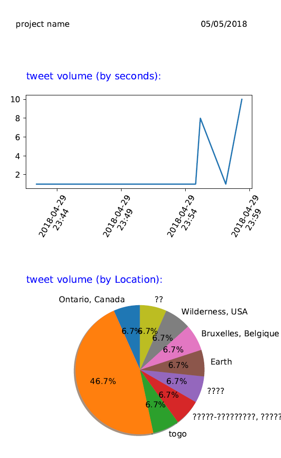

# charts in report
generate a charts in pdf report using [matplotlib](https://matplotlib.org) library

just install [matplotlib](https://matplotlib.org)
```python
pip install matplotlib
```

## Resultat : [pdf](report.pdf)


